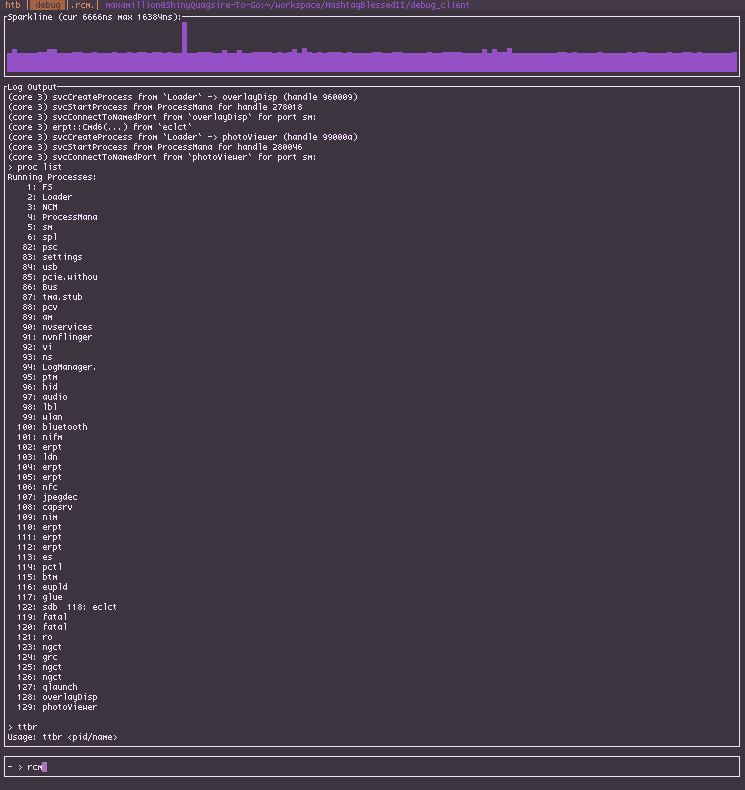

# HashtagBlessedII

HashtagBlessedII is a Nintendo Switch/Tegra T210 hypervisor written in Rust

HashtagBlessedII focuses on allowing the extension and debugging of Nintendo's proprietary Horizon microkernel via SVC/SMC/MMIO MiTM. It also provides an omnipresent USB debugger (`src/usbd/debug.rs` and `debug_client/`) for inspecting running processes and logging system state.

* See LICENSE.md for license details

NOTE: Currently only adapted for 8.0.1

## Building
* Requires `0_kernel_80060000.bin` from PK2
* Install `rustup`
* `rustup update`
* `rustup default nightly`
* `cargo install cargo-xbuild`
* `cargo install cargo-binutils`
* `rustup component add llvm-tools-preview`
* `rustup component add rust-src`
* `build.sh`

## Patches to EL3 Required
* set EL3 to drop down to EL2 instead of EL1 (A0 78 80 D2 -> 20 79 80 D2)
* allow HVC (A9 C7 80 52 -> A9 E7 80 52)
* any other sigcheck/hashing check stuff

## Running
* HTB2 replaces the kernel in its entirety, PK2/EL3 dropdown entrypoint should be set to 0xD0000000. HTB2 will extract the kernel from its data, patch it and execute it.

## USB Debug
* HTB2 will idle until a USB debugger client is connected to the device.
* The client executable can be built and run using `cargo` in `debug_client/` or via the provided shell scripts.
